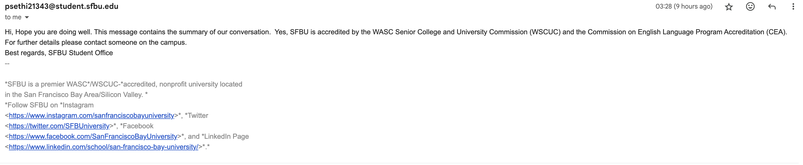

# SFBU(San Francisco Bay University) chatbot

Link to the presentation PDF - https://github.com/Prachi1615/Customer_Support_System/blob/main/Customer%20Support%20System%20(SFBU).pdf
Link to presentation PPT -  https://docs.google.com/presentation/d/1txNkCx4DFsjzUZYrTXxBaYbkQvbf7mAEr3hIXXnD6N4/edit#slide=id.p

The SFBU Chatbot is an GenAI-powered chatbot designed to assist students, parents, faculty at San Francisco Bay University (SFBU) and also aid government to know about the University. 
It is built on cutting edge technologies

# Generative AI vs Traditional AI: 
At SFBU, we utilize Generative AI to surpass the capabilities of Traditional AI, enabling our AI assistant chatbot to generate new content and make predictions from vast data patterns, thereby facilitating more interactive and dynamic user experiences.

# Fine-Tuning: 
We apply fine-tuning to our pre-trained models to tailor our AI assistant specifically for SFBU’s needs. This enhances its performance on tasks directly relevant to our university environment and student queries.

# Speech Recognition: 
Our project integrates speech recognition to convert spoken language into text, allowing for seamless voice interactions with the SFBU AI assistant. This technology empowers students to engage with the assistant hands-free, making it more accessible and convenient.

# Hallucinations and Their Resolution: 
To combat the challenge of hallucinations, where the AI might generate incorrect information, we have implemented advanced strategies to refine our models. This ensures the factual accuracy and reliability of the responses provided by our AI assistant.

# Multilingual Support: 
Recognizing the diverse linguistic background of our students, the SFBU AI assistant is equipped with multilingual support. This feature helps in breaking down language barriers and enhancing the inclusivity of our educational resources.

# Langchain: 
By incorporating Langchain into our AI assistant, we enable it to integrate language models with external data sources effectively. This not only improves the assistant’s ability to handle complex queries but also ensures contextually aware responses that are more aligned with specific student needs.

# RAG: 
RAG stands for Retrieval augmented generation. We use this technology in our project in order to enhance the quality, relevance, and factual accuracy of responses by leveraging up-to-date information from SFBU data.

## Features

- Built on OpenAI's LLM's, GPT-3.5-turbo and GPT-3.5-turbo (fine tuned over 1000 question-answer pairs)
- User friendly web interface built on Streamlit
- AI-Driven Multilingual Support
- Speech Recognition
- Dynamic Information Retrieval
- Universal Accessibility
- Responses generation in plain text or email format

## Installation

1. Clone the repository
2. Run cd backend
3. Create a virtual environment
4. Activate the virtual Environment
5. Install the required packages:
   pip install -r requirements.txt
6. Set up the OpenAI API key:
    export OPENAI_API_KEY=your-api-key
7. Run the Streamlit app:
   streamlit run app.py

## Screenshots

## UI
 

## Model Config
 

## Choose Temerature
 

## Language Config
 

## Voice Config

## Generated Text Response and Voice Response

## Response in email format
 

## Email Recieved
 

